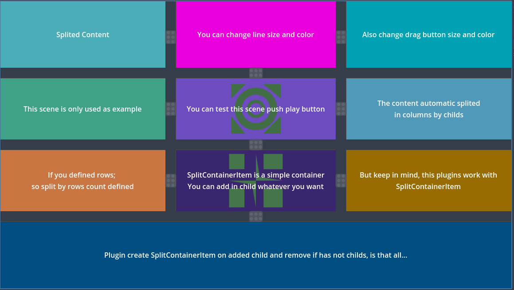
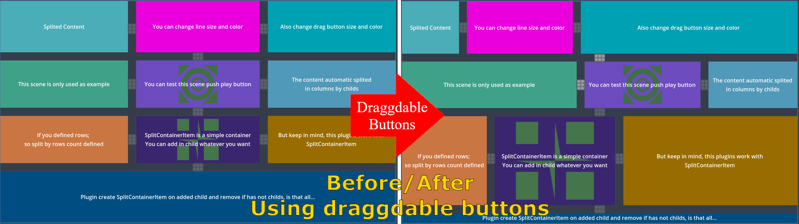

# Multi-Split-Container
Allow splitting elements into containers with the same size in the canvas rectangle.

  

>[!NOTE]
>This plugin was initially created to be used by [script-spliter <= v0.2](https://github.com/CodeNameTwister/Script-Spliter) addon.

# Features
* Auto Split in columns by child node count. (Work on nodes with base as Control)
* Auto Split in rows by you row value setted.
* Lines Size/Color Changeables.
* Drag Button Size/Color Changeables.
* Drag Button Icon Changeables.

# Preview
### image Example Scene.

### image Example Scene before/after move splited container by drag buttons.

# How Work
After enable this plugin, you can see the new node called **MultiSplitContainer**.

This node automatically creates a **SplitContainerItem** node that will be managed by **MultiSplitContainer** for split/resize.

# Nodes

>[!TIP]
>This nodes are extends by Control and work with any nodes type control.
>
>*example: Label, ColorRect, TextureRect, other controls...*
### MultiSplitContainer
This is the root and you can add any child node, this node auto add the child node to a new **SplitContainerItem**.

### SplitContainerItem
This node is created by **MultiSplitContainer** and you can add any child to this node.

##

>  You can put a issue request for bugs/changes and remember support me for more good things hey!

Copyrights (c) CodeNameTwister. See [LICENSE](LICENSE) for details.

[godot engine]: https://godotengine.org/

